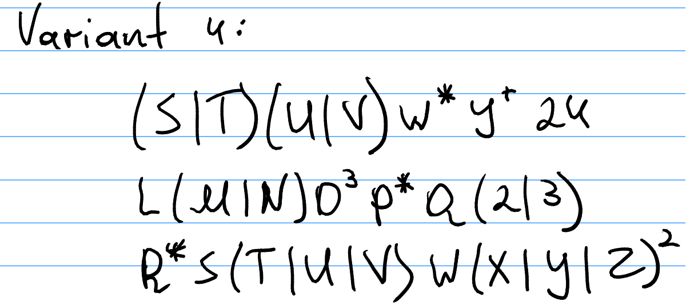
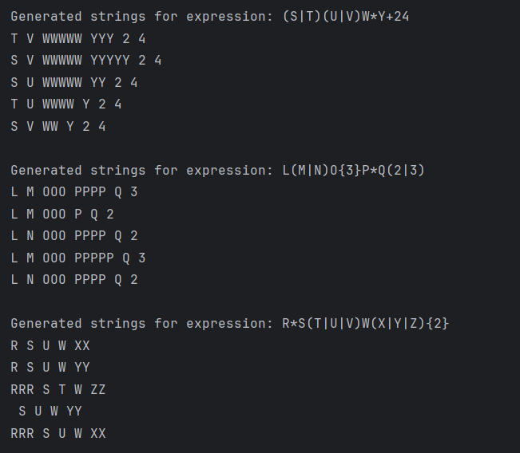

# Regular Expressions

### Course: Formal Languages & Finite Automata
### Author: Alexandru Magla | FAF-231

---

## Theory

Regular expressions (regex) are a powerful formalism used to describe and match patterns in strings. They form the backbone of many parsing and lexical analysis techniques in compilers, search engines, and text-processing tools. In formal language theory, regular expressions define the class of regular languages, which can be recognized by finite automata.

A regular expression uses a combination of **symbols**, **operators**, and **quantifiers** to describe a language. Symbols are literal characters (like `a`, `b`, `1`, `x`), and operators include concatenation, union (`|`), Kleene star (`*`), and positive closure (`+`). Parentheses are used for grouping, allowing more complex expressions to be constructed.

The purpose of this lab work is to:
1. Understand how regular expressions are processed.
2. Build a tool to generate **valid strings** for given regexes.
3. Provide **step-by-step explanations** for how these expressions are interpreted.

---

## Objectives

1. Write and cover what regular expressions are, what they are used for;

2. Below you will find 3 complex regular expressions per each variant. Take a variant depending on your number in the list of students and do the following:

   a. Write a code that will generate valid combinations of symbols conform given regular expressions (examples will be shown).

   b. In case you have an example, where symbol may be written undefined number of times, take a limit of 5 times (to evade generation of extremely long combinations);

   c. Bonus point: write a function that will show sequence of processing regular expression (like, what you do first, second and so on)

Write a good report covering all performed actions and faced difficulties.

---

## Regular Expressions (Variant 4)



The regular expressions chosen for generation and analysis are:

1. `(S|T)(U|V)W*Y+24`
2. `L(M|N)O{3}P*Q(2|3)`
3. `R*S(T|U|V)W(X|Y|Z){2}`

Each expression defines a set of strings that follow a specific structure involving character choices, repetitions, and fixed suffixes. Our task is to **generate all matching strings** with a limited number of repetitions and explain how they are interpreted.

---

## Implementation Description

### `RegexPatterns.java`

`RegexPatterns` is a simple container class meant to store multiple regex pattern variants. Even though it only holds static data, wrapping it inside a class helps organize the code and group related constants together.

`VARIANT_4` is a map that holds three regex patterns. Each key (like "regex_1") is a label for a particular regular expression, and the value is a string that represents the regex pattern.

```java
import java.util.Map;

public class RegexPatterns {
    public static final Map<String, String> VARIANT_4 = Map.of(
        "regex_1", "(S|T)(U|V)W*Y+24",
        "regex_2", "L(M|N)O{3}P*Q(2|3)",
        "regex_3", "R*S(T|U|V)W(X|Y|Z){2}"
    );
}
```

---

### `Generator.java`

The `Generator` class is responsible for parsing regular expressions and generating valid strings that match them. The implementation handles regex parsing dynamically.
It processes groups `( )` with alternatives `|`, handles quantifiers `*`, `+`, `?`, and `{n}`, limits repetitions to 5 for unbounded quantifiers, and generates random valid strings.

```java

    public String generateString() {
        List<String> string = new ArrayList<>();
        int i = 0;

        while (i < expr.length()) {
            char ch = expr.charAt(i);

            switch (ch) {
                case '(' -> {
                    int groupEnd = expr.indexOf(")", i);
                    String groupContent = expr.substring(i + 1, groupEnd);
                    String selected = generateGroup(groupContent);
                    string.add(selected);
                    i = groupEnd;
                }
               ...
                case '{' -> {
                    if (i + 2 < expr.length() && expr.charAt(i + 2) == '}') {
                        int repeat = Character.getNumericValue(expr.charAt(i + 1));
                        String last = string.remove(string.size() - 1);
                        string.add(last.repeat(repeat));
                        i += 2;
                    }
                }
                case '|', ')', '}' -> {}
                default -> string.add(String.valueOf(ch));
            }

            i++;
        }

        return String.join(" ", string);
    }

    private String generateGroup(String groupExpr) {
        String[] options = groupExpr.split("\\|");
        return options[random.nextInt(options.length)];
    }

    public void generateNStrings() {
        for (int i = 0; i < 5; i++) {
            System.out.println(generateString());
        }
    }
}
```

---

### `Main.java`

The `Main` class serves as the entry point of the regular expression generator program. It coordinates the generation of valid strings from regex patterns and displays their structure and examples in a readable format.

```java
import java.util.Map;

public class Main {
    public static void main(String[] args) {
        for (Map.Entry<String, String> entry : RegexPatterns.VARIANT_4.entrySet()) {
            System.out.println("\nGenerated strings for expression (" + entry.getKey() + "): " + entry.getValue());
            Generator generator = new Generator(entry.getValue());
            generator.generateNStrings();
        }
    }
}
```

---

## Results

Running the Java code on the three expressions produces different sets of valid strings. Below are example outputs with screenshot:



---

## Conclusions

In this lab, the generation of valid strings from regular expressions was analyzed and implemented. We built a modular Java tool that interprets regex definitions, generates matching strings up to a bounded depth, and explains the internal processing steps for each pattern. This lab helped solidify our understanding of regular languages and gave us a hands-on approach to working with regex in a theoretical and practical context.

---

## References

1. [Regular Expressions - Wikipedia](https://en.wikipedia.org/wiki/Regular_expression)
2. [Formal Language Theory](https://en.wikipedia.org/wiki/Formal_language)
3. [Java Regex Tutorial](https://docs.oracle.com/javase/tutorial/essential/regex/)