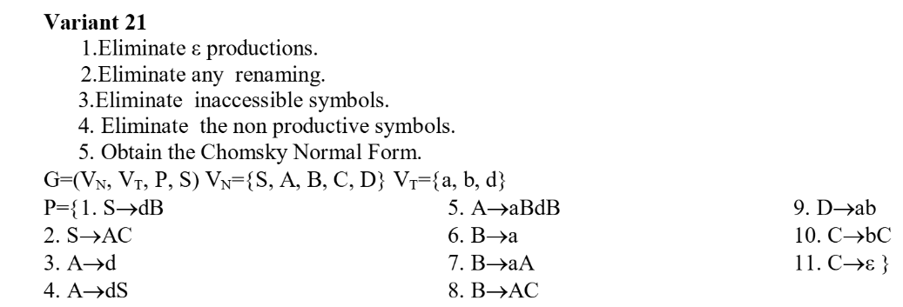
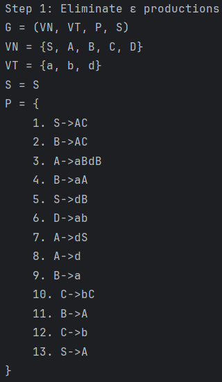
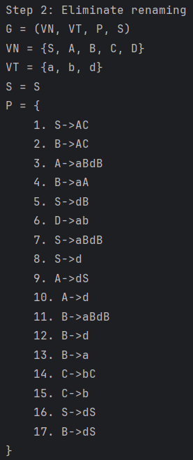
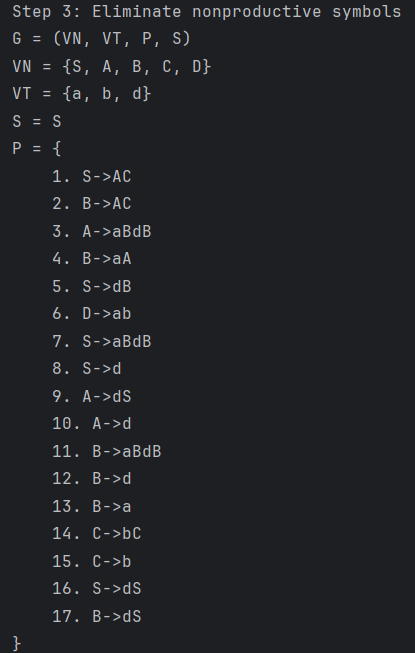
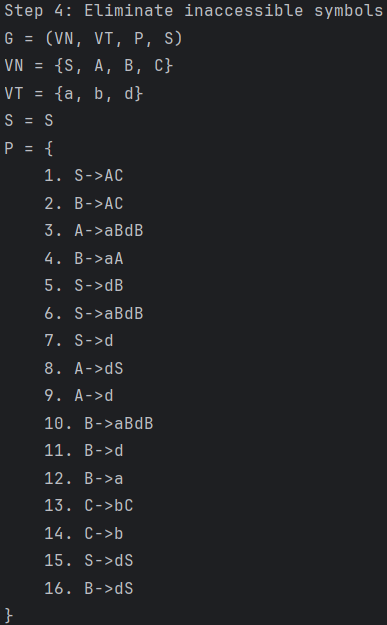
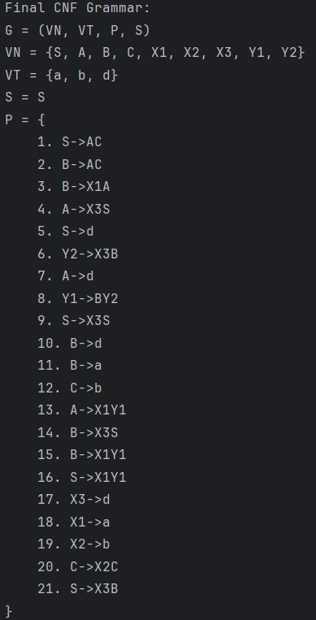

# LAB 5 : Chomsky Normal Form

### Course: Formal Languages & Finite Automata
### Author: Alexandru Magla

----

## Theory
Chomsky Normal Form (CNF) is a standard form used in context-free grammars, where every production rule adheres to specific structures. In CNF, each production must be of the form ```A → BC``` or ```A → a```, where A, B, and C are non-terminal symbols (with B and C not being the start symbol), and a is a terminal symbol. This form is particularly useful in parsing algorithms like the CYK (Cocke–Younger–Kasami) algorithm. To convert a grammar into CNF, several steps must be followed systematically. First, eliminate ε-productions (productions that derive the empty string), except in the case where the start symbol derives ε. Second, remove unit productions, which are rules where a non-terminal maps directly to another non-terminal. Third, eliminate useless symbols—those that do not contribute to deriving terminal strings. Next, rewrite rules so that the right-hand side of every production has at most two non-terminals or a single terminal. For productions with more than two non-terminals on the right-hand side, introduce new variables to break them into binary productions. Similarly, replace terminals in mixed productions (i.e., those with both terminals and non-terminals) with new non-terminal symbols representing the terminals. By carefully applying these steps, any context-free grammar can be transformed into an equivalent grammar in Chomsky Normal Form.
## Objectives:
1. Learn about Chomsky Normal Form (CNF).
2. Get familiar with the approaches of normalizing a grammar.
3. Implement a method for normalizing an input grammar by the rules of CNF.
1. The implementation needs to be encapsulated in a method with an appropriate signature (also ideally in an appropriate class/type).
2. The implemented functionality needs executed and tested.
3. Also, another **BONUS point** would be given if the student will make the aforementioned function to accept any grammar, not only the one from the student's variant.

Variant 21:



## Implementation description

### The ```eliminateEpsilonProductions``` method
* At the beginning of the method, the current set of grammar rules and non-terminal symbols are retrieved and stored in local variables for processing.
    ```java
    String[] rules = grammar.getRules();
    String[] nonTerminals = grammar.getNonTerminals();
    ```
* Next, the method identifies all nullable symbols in the grammar—non-terminals that can derive ε either directly or indirectly. This is achieved by calling the ```findNullableSymbols``` helper method, which returns a set of such symbols.
  ```java
  Set<String> nullableSymbols = findNullableSymbols(grammar);
  ```
* With the nullable symbols identified, the method proceeds to create a new set of rules that simulate all possible combinations where nullable symbols are either included or excluded. This is done using the ```generateRulesWithoutEpsilon ```helper method.
  ```java
  List<String> newRules = generateRulesWithoutEpsilon(grammar, nullableSymbols);
  ```
* After generating the new set of rules, a new ```Grammar``` object is created. This new grammar retains the same set of non-terminals, terminals, and start symbol as the original grammar, but replaces the rules with the updated ε-free versions.
  ```java
  Grammar result = new Grammar(
      nonTerminals,
      grammar.getTerminals(),
      newRules.toArray(new String[0]),
      grammar.getStartSymbol()
  );
  ```
### The ```generateCombinations``` method
* First, the method initializes a list indices to keep track of all positions in the right string where the nullable symbol appears.
  ```java
  List<Integer> indices = new ArrayList<>();
  ```
* It then iterates through the right string and checks for occurrences of the nullable symbol. If a match is found, the index is recorded in the indices list.
  ```java
  for (int i = 0; i < right.length(); i++) {
      if (i + nullable.length() <= right.length() &&
              right.substring(i, i + nullable.length()).equals(nullable)) {
          indices.add(i);
      }
  }
  ```
* If any occurrences of the nullable symbol are found, the method enters a loop to generate new versions of the rule with one instance of the nullable symbol removed at a time.
  ```java
   if (!indices.isEmpty()) {
              for (int pos : indices) {
  ```
* For each found position, a new right-hand side string is constructed by omitting the nullable symbol at that index. If the resulting right-hand side is not empty, a new rule is formed and added to the rules set.
  ```java
  String newRight = right.substring(0, pos) + right.substring(pos + nullable.length());
  if (!newRight.isEmpty()) {
      String newRule = left + "->" + newRight;
  ```
* To prevent duplicate rule generation, the method adds the new rule to the rules set and then recursively calls itself with the updated right-hand side. This ensures all valid combinations are explored.
  ```java
  if (rules.add(newRule)) {
      generateCombinations(rules, left, newRight, nullable);
  }
  ```
### The ```eliminateRenaming``` method

* The method takes a ```Grammar``` object as input and extracts its rules and non-terminals for processing. A set named ```directRenamings``` is initialized to store rules that are identified as direct renamings.
  ```java
  String[] rules = grammar.getRules();
  String[] nonTerminals = grammar.getNonTerminals();
  Set<String> directRenamings = new HashSet<>();
  ```
* It then iterates through each rule and checks if the right-hand side of the rule consists of a single non-terminal. If so, it is added to the ```directRenamings``` set.
  ```java
  for (String rule : rules) {
      String[] parts = rule.split("->");
      String left = parts[0];
      String right = parts[1];
      ...
      if (isRenaming) {
          directRenamings.add(rule);
      }
  }
  ```
* The method proceeds to compute the transitive closure of these renaming rules, allowing indirect renaming paths (e.g., if A -> B and B -> C, then A -> C) to also be captured. This is stored in the ```renamingClosure``` set.
  ```java
  Set<String> renamingClosure = new HashSet<>(directRenamings);
  ...
  while (changed) {
      ...
      renamingClosure.addAll(newRenamings);
  }
  ```
* A new set ```newRules``` is created to hold the final rules. First, all original rules that are not renaming productions are added to this set.
  ```java
  for (String rule : rules) {
      ...
      if (!isRenaming) {
          newRules.add(rule);
      }
  }
  ```

* The method then uses the ```renamingClosure``` to discover and add new rules that preserve the semantics of the grammar without using renaming. For each renaming pair ```A -> B```, if there is a rule ```B -> α``` where α is not a single non-terminal, it adds a new rule ```A -> α```.
  ```java
  for (String renaming : renamingClosure) {
      ...
      if (right.equals(ruleLeft) && !containsOnlyNonTerminal(ruleRight, nonTerminals)) {
          newRules.add(left + "->" + ruleRight);
      }
  }
  ```
### The ```eliminateNonproductive``` method

* A non-terminal is considered directly productive if it produces a string composed only of terminal symbols (e.g., A -> ab). These are discovered by iterating through each rule and checking that every symbol on the right-hand side is a terminal.
  ```java
  for (String rule : rules) {
      ...
      if (onlyTerminals) {
          productive.add(left);
      }
  }
  ```
* After finding directly productive symbols, the method continues by identifying indirectly productive symbols. A symbol is indirectly productive if all symbols on the right-hand side of its rule are either terminals or other productive non-terminals. This is done iteratively until no new productive symbols are found (fixed-point computation):
  ```java
  while (changed) {
      ...
      if (allSymbolsProductive) {
          productive.add(left);
          changed = true;
      }
  }
  ```

* After filtering rules, the list of non-terminals is also updated to include only productive ones.
  ```java
  for (String nt : nonTerminals) {
      if (productive.contains(nt)) {
          productiveNonTerminals.add(nt);
      }
  }
  ```

### The ```eliminateInaccesible``` method

* The accessibility check starts from the grammar's start symbol. This set will keep track of all symbols (initially just the start symbol) that can be reached directly or indirectly from it.
  ```java
  Set<String> accessible = new HashSet<>();
  accessible.add(startSymbol);
  ```

* Once all accessible symbols are known, this part filters the original list of non-terminals, keeping only those that are accessible. Inaccessible non-terminals are removed from the grammar.
  ```java
  List<String> accessibleNonTerminals = new ArrayList<>();
  for (String nt : nonTerminals) {
      if (accessible.contains(nt)) {
          accessibleNonTerminals.add(nt);
      }
  }
  ```
* Terminals are considered accessible if they appear in the body of any rule whose left-hand side is accessible. This part ensures that only such terminals are included in the final grammar.
  ```java
  Set<String> accessibleTerminals = new HashSet<>();
  for (String terminal : terminals) {
      for (String rule : rules) {
          String[] parts = rule.split("->");
          String left = parts[0];
          String right = parts[1];
  
          if (accessible.contains(left) && right.contains(terminal)) {
              accessibleTerminals.add(terminal);
              break;
          }
      }
  }
  ```
* Here, only the rules that originate from accessible non-terminals are retained. Rules with inaccessible left-hand sides are discarded, as they can't be used in any derivation starting from the start symbol.
  ```java
  List<String> accessibleRules = new ArrayList<>();
  for (String rule : rules) {
      String[] parts = rule.split("->");
      String left = parts[0];

      if (accessible.contains(left)) {
          accessibleRules.add(rule);
      }
  }
  ```

### The ```convertToChomsky``` method

* To conform to CNF, terminals in longer productions must be replaced by non-terminals. This loop introduces new rules like X1 → a, X2 → b, etc., and remembers them in the terminalToNonTerminal map for later substitution.
  ```java
  for (String terminal : terminals) {
      String symbol = "X" + (++newSymbolCounter);
      terminalToNonTerminal.put(terminal, symbol);
      newNonTerminals.add(symbol);
      cnfRules.add(symbol + "->" + terminal);
  }
  ```
* Each rule is processed individually. The left-hand side is the non-terminal, and the right-hand side is a sequence of symbols that may need to be transformed into CNF form.
  ```java
  for (String rule : rules) {
      String[] split = rule.split("->");
      String left = split[0];
      String right = split[1];
  ```
* If a rule is already in CNF (e.g., A → BC or A → a), it is added as-is.
  ```java
      if (isInCNF(right, nonTerminals, terminals)) {
          cnfRules.add(rule);
          continue;
      }

      if (right.length() == 1 && Arrays.asList(terminals).contains(right)) {
          cnfRules.add(rule);
          continue;
      }
  ```
* For rules with multiple symbols on the right-hand side, any terminals are replaced with their corresponding Xi non-terminal using the earlier mappings. This prepares the rule for proper CNF transformation.
  ```java
      List<String> symbols = new ArrayList<>();
      for (char ch : right.toCharArray()) {
  String sym = String.valueOf(ch);
          if (Arrays.asList(terminals).contains(sym)) {
  sym = terminalToNonTerminal.get(sym);
          }
                  symbols.add(sym);
      }
  ```
* Rules with 1 or 2 symbols on the right-hand side are valid CNF and are directly added. Longer productions (3 or more symbols) are broken down into binary rules recursively using a helper method ```breakDownWithY```.
  ```java
      if (symbols.size() == 1) {
          cnfRules.add(left + "->" + symbols.get(0));
      } else if (symbols.size() == 2) {
          cnfRules.add(left + "->" + symbols.get(0) + symbols.get(1));
      } else {
          breakDownWithY(left, symbols, cnfRules, patternToY, newNonTerminals);
      }
  ```

*
## Results

The images show a step-by-step process of converting a context-free grammar to Chomsky Normal Form (CNF), with each step correctly following standard transformation procedures:
* **Step 1** correctly eliminates all ε-productions (empty string productions like C→ε), replacing them with alternative derivations that preserve the grammar's generated language. The production C→e disappears, and new rules are added to account for cases where C could be present or absent.
  
* **Step 2** properly eliminates unit productions (rules of form A→B), replacing them with the productions of the right-hand variable. For example, B→A is removed and replaced with B→aBdB, B→d, and B→dS, which are A's productions.


* **Step 3** correctly identifies and removes nonproductive symbols - those that cannot derive any terminal string. The grammar maintains all productive symbols and their associated rules.


* **Step 4** accurately eliminates inaccessible symbols by removing the nonterminal D and its production D→ab, as D cannot be reached from the start symbol S through any derivation path.


* **Step 5** properly converts the grammar to CNF by introducing new nonterminals (X1, X2, X3, Y1, Y2) to ensure all productions follow either the form A→BC (two nonterminals) or A→a (single terminal). Complex productions like A→aBdB are broken down into multiple CNF-compliant rules, correctly preserving the language generated by the original grammar.




## Conclusions
In conclusion, this laboratory provided valuable insight into the process of transforming context-free grammars into Chomsky Normal Form. While the initial steps such as removing null, unit, and inaccessible productions were straightforward, the final step of converting the grammar into CNF proved to be more challenging due to the complexity of handling long right-hand sides. Manually working through examples helped clarify the required transformations and revealed patterns that were not immediately obvious in code. This approach deepened my understanding and ultimately made implementing the algorithm more intuitive.
## References
1. Wikipedia. *Chomsky normal form*. Available at: [https://en.wikipedia.org/wiki/Chomsky_normal_form](https://en.wikipedia.org/wiki/Chomsky_normal_form)