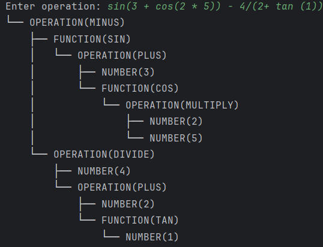

# LAB 6 : Parser & Building an Abstract Syntax Tree

### Course: Formal Languages & Finite Automata
### Author: Alexandru Magla

----

## Theory
Parsing is the process of analyzing a sequence of tokens to determine its grammatical structure according to a formal grammar. It acts as a bridge between raw input and meaningful hierarchical representations that computers can further process. A parser systematically checks if the given input sequence is valid and organizes it into a structured form. If the input follows the rules of the grammar, the parser produces a structured output called an Abstract Syntax Tree (AST).

An Abstract Syntax Tree (AST) is a tree-like data structure that represents the syntactic structure of the input without unnecessary syntax details. Each node in the AST corresponds to a construct occurring in the source input, such as operations, numbers, or functions. The AST captures the essential meaning and relationships between different parts of the input in a way that is easier to manipulate and evaluate. Together, parsing and AST generation form a crucial foundation for interpreters, compilers, and advanced processing tools that work with structured languages like mathematical expressions or programming code.

The parser often works in stages, such as lexical analysis followed by syntactic analysis, to build the AST correctly. Different types of parsers exist, such as recursive descent parsers, LL parsers, and LR parsers, depending on the complexity of the grammar they are designed to handle. Building an AST not only helps in validating the input but also allows further steps like optimization, evaluation, or code generation in more advanced systems.
## Objectives:
1. Get familiar with parsing, what it is and how it can be programmed [1].
2. Get familiar with the concept of AST [2].
3. In addition to what has been done in the 3rd lab work do the following:
1. In case you didn't have a type that denotes the possible types of tokens you need to:
   1. Have a type __*TokenType*__ (like an enum) that can be used in the lexical analysis to categorize the tokens.
   2. Please use regular expressions to identify the type of the token.
2. Implement the necessary data structures for an AST that could be used for the text you have processed in the 3rd lab work.
3. Implement a simple parser program that could extract the syntactic information from the input text.


## Implementation description

### The ```print``` method
* At the beginning of the method, the current node's value is printed to the console with an appropriate prefix that visually represents the tree structure. The prefix depends on whether the current node is the last child (```isTail```) or not, resulting in either a ```└── ```or ```├──``` symbol.
  ```java
  System.out.println(prefix + (isTail ? "└── " : "├── ") + type.name() + "(" + value + ")");
  ```
* After printing the current node, the method iterates over all its child nodes stored in the children list. For each child node, the print method is called recursively to continue printing the entire subtree.
  ```java
  for (int i = 0; i < children.size(); i++) {
      children.get(i).print(prefix + (isTail ? "    " : "│   "), i == children.size() - 1);
  }
  ```

### The ```NodeType``` enumeration
* The NodeType enum is defined to represent the different types of nodes that can appear in the Abstract Syntax Tree (AST). Enumerations like NodeType allow the program to categorize each node clearly, ensuring consistent labeling and easier processing later
  ```java
  public enum NodeType {
      NUMBER,
      FUNCTION,
      OPERATION
  }
  ```
* The ```NUMBER``` constant represents nodes that store numeric values, such as integers or floating-point numbers, parsed from the input expression.
* The ```FUNCTION``` constant is used for nodes that represent mathematical functions like sin, cos, and tan, allowing the parser and AST to distinguish functional operations from arithmetic ones.
* The ```OPERATION``` constant is used for nodes that represent arithmetic operations such as addition (+), subtraction (-), multiplication (*), division (/), or exponentiation (^).

### The ```static``` initialization block for token patterns
* At the beginning of the static block, a ```StringBuilder``` named ```patternsBuilder``` is created to efficiently construct the regular expression pattern that will match all possible token types in the input text.
  ```java
  StringBuilder patternsBuilder = new StringBuilder();
  ```
* The ```patternsBuilder``` then appends different regular expression parts for each type of token. Each token type is wrapped in a named group (using the ```(?<NAME>...)``` syntax) to allow easy identification later during tokenization. For example, numbers, functions (sin, cos, tan), arithmetic operators, parentheses, and whitespace are all included.
  ```java
  patternsBuilder.append("|(?<NUMBER>\\d+(\\.\\d+)?)");
  patternsBuilder.append("|(?<SIN>sin)");
  patternsBuilder.append("|(?<COS>cos)");
  patternsBuilder.append("|(?<TAN>tan)");
  patternsBuilder.append("|(?<PLUS>\\+)");
  patternsBuilder.append("|(?<MINUS>\\-)");
  patternsBuilder.append("|(?<MULTIPLY>\\*)");
  patternsBuilder.append("|(?<DIVIDE>/)");
  patternsBuilder.append("|(?<POWER>\\^)");
  patternsBuilder.append("|(?<LPAREN>\\()");
  patternsBuilder.append("|(?<RPAREN>\\))");
  patternsBuilder.append("|(?<WHITESPACE>\\s+)");
  ```
* After all the parts are appended, the final regular expression is compiled into a Pattern object named tokenPatterns. The call to ```substring(1)``` removes the very first extra ```|``` character added at the beginning of the pattern string.
  ```java
  tokenPatterns = Pattern.compile(patternsBuilder.substring(1));
  ```
### The ```parseExpressions``` method
* At the beginning of the method, the parseTerm() function is called to parse the first term of the expression. This term becomes the initial subtree that will be built upon as additional operations are processed.
  ```java
  ASTNode node = parseTerm();
  ```
* The method then enters a while loop to handle addition (+) and subtraction (-) operations. As long as the current token is a PLUS or MINUS, the loop continues processing, building the tree structure accordingly.
  ```java
  while (getCurrentToken().getType() == TokenType.PLUS ||
                  getCurrentToken().getType() == TokenType.MINUS) {
              Token op = getCurrentToken();
              advance();
              ASTNode right = parseTerm();
              ASTNode opNode = new ASTNode(NodeType.OPERATION, op.getType().toString());
              opNode.addChild(node);
              opNode.addChild(right);
              node = opNode;
          }
  ```
### The ```parseTerm``` method
* At the beginning of the method, the ```parseFactor()``` function is called to parse the first factor of the term. This factor becomes the starting subtree that will be expanded if further multiplication or division operations are encountered.
```java
ASTNode node = parseFactor();
```
* The method then enters a ```while``` loop to handle multiplication (*) and division (/) operations. As long as the current token is either a ```MULTIPLY``` or ```DIVIDE```, the loop continues to process the input accordingly.
  ```java
  while (getCurrentToken().getType() == TokenType.MULTIPLY ||
          getCurrentToken().getType() == TokenType.DIVIDE) {
      ...
  }
  ```
* Inside the loop, the current operator token (* or /) is retrieved and stored in a local variable op. After that, the parsing position is advanced to the next token to continue building the tree.
  ```java
  Token op = getCurrentToken();
  advance();
  ```
* The right-hand side operand of the operation is parsed by calling ```parseFactor()``` again, producing the subtree for the next operand.
  ```java
  ASTNode right = parseFactor();
  ```

* A new ASTNode is then created to represent the operation. Its type is set to ```NodeType.OPERATION```, and its value is the string representation of the operator token.
  ```java
  ASTNode opNode = new ASTNode(NodeType.OPERATION, op.getType().toString());
  ```
* The previously parsed node (```node```) and the newly parsed right-hand side (```right```) are added as children of the new operation node. This preserves the correct hierarchical structure for multiplication and division operations.
  ```java
  opNode.addChild(node);
  opNode.addChild(right);
  node = opNode;
  ```
### The ```parseFactor``` method
* At the beginning of the method, the current token is retrieved using ```getCurrentToken()```. This token is examined to determine the correct kind of factor to parse.
  ```java
  Token token = getCurrentToken();
  ```
* If the token is a ```NUMBER```, it represents a simple numeric value. The parser advances the token position and returns a new ```ASTNode``` of type ```NUMBER``` containing the number's value.
  ```java
  if (token.getType() == TokenType.NUMBER) {
      advance();
      return new ASTNode(NodeType.NUMBER, token.getValue());
  }
  ```
* If the token corresponds to a trigonometric function (```SIN, COS, or TAN```), the parser advances past the function name and expects an opening parenthesis ```(```. It then parses the inner expression inside the parentheses and expects a closing parenthesis ```)```. A new ASTNode of type ```FUNCTION``` is created to represent the function, with the parsed argument as its child.
  ```java
  else if (token.getType() == TokenType.SIN || token.getType() == TokenType.COS || token.getType() == TokenType.TAN) {
      advance();
      expect(TokenType.LPAREN);
      ASTNode argument = parseExpression();
      expect(TokenType.RPAREN);
      ASTNode funcNode = new ASTNode(NodeType.FUNCTION, token.getType().toString());
      funcNode.addChild(argument);
      return funcNode;
  }
  ```
* If the token is a left parenthesis ```(```, it indicates a grouped subexpression. The parser advances past the ```(```, parses the enclosed expression recursively, and expects a matching right parenthesis ```)``` before returning the parsed subtree.
  ```java
  else if (token.getType() == TokenType.LPAREN) {
      advance();
      ASTNode node = parseExpression();
      expect(TokenType.RPAREN);
      return node;
  }
  ```
* If none of the expected tokens are found, the method throws a RuntimeException to signal an unexpected token, indicating invalid input.
  ```java
  else {
      throw new RuntimeException("Unexpected token: " + token);
  }
  ```

## Results

When parsing the expression ```sin(3 + cos(2 * 5)) - 4 / (2 + tan(1))```, the lexer correctly identifies numbers, operations, functions, and parentheses without errors. The parser builds an abstract syntax tree (AST) that respects operator precedence: multiplications and divisions are nested deeper than additions or subtractions. Function calls like ```sin```, ```cos```, and ```tan``` correctly create parent nodes with their respective arguments as child expressions. Grouping using parentheses is handled properly, ensuring that subexpressions like ```(2 * 5)``` and ```(2 + tan(1))``` are treated as single units inside larger expressions. The final AST reflects the original mathematical structure faithfully, demonstrating that both tokenization and parsing work accurately even for complex, nested expressions.



## Conclusions
In conclusion, this laboratory provided valuable insight into the process of lexical analysis, parsing, and abstract syntax tree (AST) construction. While tokenizing basic elements like numbers, operators, and functions was easily done, handling the correct grouping of expressions using parentheses was more challenging. Building the AST while preserving operator precedence and properly nesting function calls required careful recursive parsing logic. Manually working through complex examples helped clarify how expressions must be structured within the tree and revealed subtle issues that were not immediately obvious in the initial implementation. This process deepened my understanding of parsing techniques and made the relationship between syntax and tree structure much clearer.
## References
1. Wikipedia. *Parsing*. Available at: [https://en.wikipedia.org/wiki/Parsing](https://en.wikipedia.org/wiki/Parsing)
2. Wikipedia. *Abstract Syntax Tree*. Available at: [https://en.wikipedia.org/wiki/Abstract_syntax_tree](https://en.wikipedia.org/wiki/Abstract_syntax_tree)